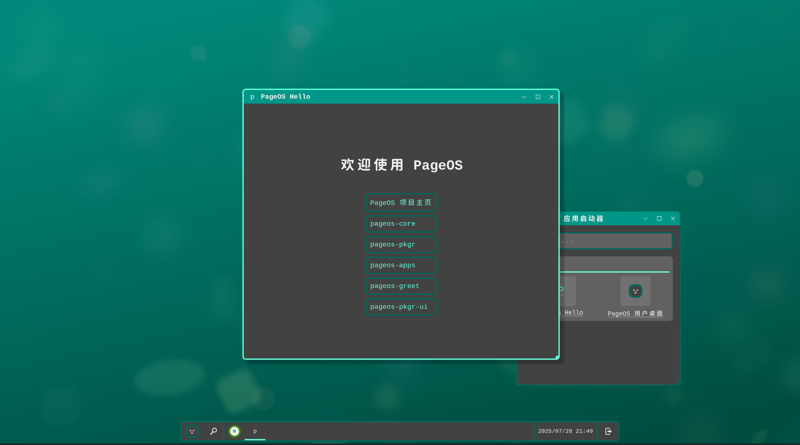
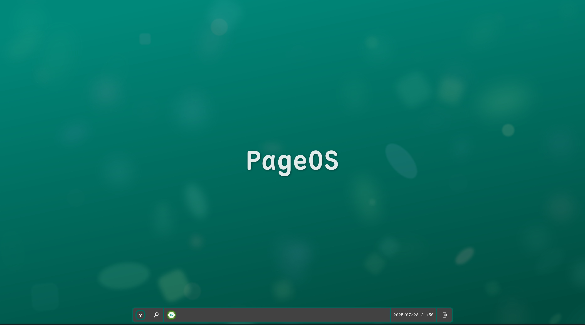

# PageOS 用户界面 (pageos-ui)

PageOS 是一个基于 Arch Linux 的创新操作系统项目，将传统桌面环境替换为运行在浏览器中的现代化用户界面。本仓库包含 PageOS 的 HTML/CSS/JavaScript 用户界面实现。

| PageOS 用户界面预览                      | 桌面                      |
| ---------------------------------------- | ------------------------- |
|  |  |

## 功能特性

- 🖥️ **完整的桌面环境**：窗口管理、任务栏、系统托盘
- 🪟 **多窗口支持**：拖动、调整大小、最小化/最大化
- 🕒 **实时系统状态**：时间日期、电池状态显示
- 🖱️ **上下文菜单**：支持窗口和任务栏的右键操作
- 🎨 **现代化设计**：深色主题与流畅动画
- 💻 **响应式布局**：适应不同屏幕尺寸

## 技术架构

PageOS 用户界面基于纯 Web 技术构建：

- **核心**：纯 HTML/CSS/JavaScript（无框架依赖）
- **渲染引擎**：Firefox 浏览器（Kiosk 模式）
- **显示协议**：Wayland 通过 Cage 显示服务器
- **系统集成**：通过 WebSocket 与 Rust 后端通信

## 安装与使用

### 前提条件

- Arch Linux 系统
- Cage（Wayland 合成器）
- Firefox 浏览器

### 快速启动

1. 克隆本仓库：

   ```bash
   git clone https://github.com/swaybien/pageos-ui.git
   cd pageos-ui
   ```

2. 启动用户界面：
   ```bash
   cage -s -- firefox --kiosk --no-remote index.html
   ```

## 开发指南

### 项目结构

```
.
└── index.html              # 主界面文件（包含所有HTML/CSS/JS）
```

### 核心模块

1. **窗口管理器**：

   - 窗口创建、拖动、调整大小
   - 多标签页支持
   - 最小化/最大化/全屏功能

2. **任务栏系统**：

   - 自动隐藏/显示任务栏
   - 窗口切换按钮
   - 系统状态显示（时间、电池）

3. **上下文菜单**：
   - 文本操作菜单（复制/粘贴等）
   - 窗口控制菜单（移动/最小化/关闭）

### 自定义主题

通过修改 CSS 变量自定义界面：

```css
:root {
  --accent-color: #64ffda; /* 主色调 */
  --content-bg-color: #424242; /* 内容背景 */
  --accent-font-color: #f5f5f5; /* 文字颜色 */
  /* 更多变量... */
}
```

## 系统集成

用户界面与 PageOS 核心服务通过 WebSocket 通信，支持：

- 系统命令执行
- 文件系统访问
- 电源管理（重启/关机）
- 应用安装与管理

## 贡献指南

欢迎贡献！请遵循以下流程：

1. Fork 本仓库
2. 创建新分支 (`git checkout -b feature/your-feature`)
3. 提交更改 (`git commit -am 'Add some feature'`)
4. 推送到分支 (`git push origin feature/your-feature`)
5. 创建 Pull Request

## 路线图

- [ ] 应用启动器实现
- [ ] 系统设置界面
- [ ] 通知中心
- [ ] 多语言支持
- [ ] 主题切换功能

## 许可证

本项目采用 [MPL-2.0 许可证](LICENSE.md)。

---

**PageOS 项目**
一个基于 Web 的创新操作系统
[项目主页](https://github.com/swaybien/pageos) | [核心服务](https://github.com/swaybien/pageos-core) | [应用仓库](https://github.com/swaybien/pageos-apps)
